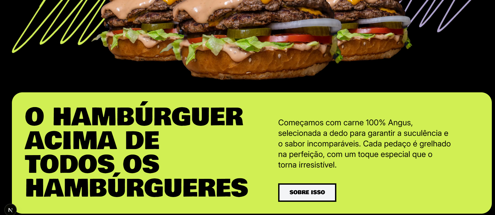

# 🍔 Projeto Burger - Hamburgueria Orgânica

## 📌 Sobre o Projeto
Este projeto foi desenvolvido utilizando **Next.js 13+ com App Router**, **Tailwind CSS** e outras tecnologias modernas para criar uma interface responsiva e dinâmica para uma hamburgueria orgânica fictícia.

## 🎨 Layout
O design foi inspirado em um modelo no **Figma**, com elementos modernos, fontes personalizadas e animações para melhorar a experiência do usuário.

## 🚀 Tecnologias Utilizadas
- **Next.js 13+** (App Router)
- **React**
- **Tailwind CSS**
- **TypeScript**
- **Next Image Optimization**

## 📂 Estrutura de Pastas
```
├── public/assets/         # Imagens e vetores do projeto
├── src/
│   ├── app/              # Páginas do Next.js
│   ├── components/       # Componentes reutilizáveis
│   ├── styles/           # Estilos globais
│   ├── utils/            # Funções auxiliares
│   ├── tailwind.config.js # Configuração do Tailwind
│   ├── tsconfig.json     # Configuração do TypeScript
```

## 📦 Instalação e Execução
1. Clone este repositório:
   ```sh
   git clone https://github.com/elanealencar/burger.git
   ```
2. Acesse a pasta do projeto:
   ```sh
   cd nome-do-repo
   ```
3. Instale as dependências:
   ```sh
   npm install  # ou yarn install
   ```
4. Inicie o servidor de desenvolvimento:
   ```sh
   npm run dev  # ou yarn dev
   ```
5. Abra no navegador:
   ```
http://localhost:3000
```

## 🖼️ Capturas de Tela



---
✍️ Criado por [Elane Alencar](https://github.com/elanealencar)

